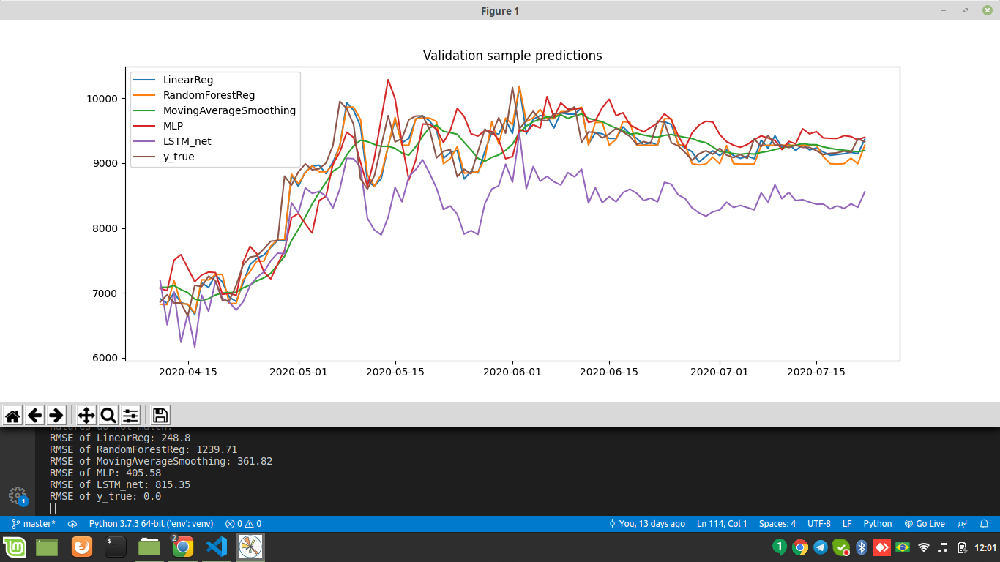
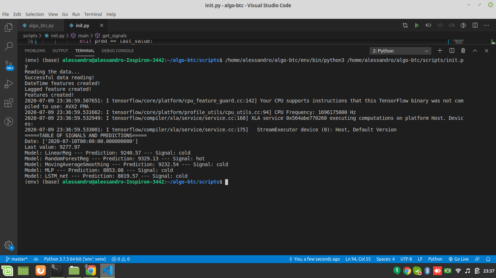

# algo-btc

Setup steps
1. Make sure you have python3 installed. https://www.python.org/downloads/
2. If you do not have the pip package manager, install it. https://pip.pypa.io/en/stable/installing/
3. In the main directory, run the following command: pip3 install -r requirements.txt
   That will install all libraries needed to the project
   
The init.py file has three actions in the main function:
1. 'validation' runs the validation of the models as you can see the image
2. 'train_model' updates the training step of the models and save them
3. 'get_sginals' load the models and make predictions and signals

Five models were developed:
1. Linear Regression
2. Random Forest Regressor, with Grid Search
3. Moving Average Smoothing
4. LSTM Network
5. Multi-layer perceptron

All the models has as input the 7 last observations of BTC value

